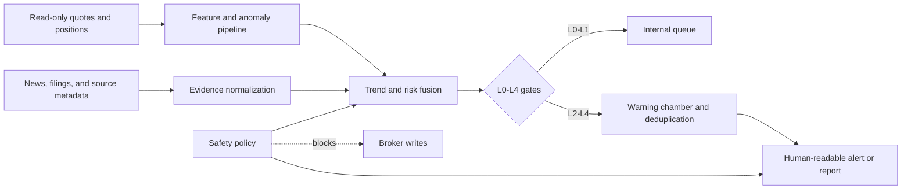

# Market Watchdog

[](https://github.com/jasperjlou/market-watchdog/actions/workflows/tests.yml)

Market Watchdog is a read-only market-intelligence and alerting system for U.S. equities. It combines layered price scans, theme-aware news collection, source-quality grading, read-only Moomoo OpenD data, and bounded AI review to produce explainable outlooks and deduplicated alerts without placing trades.

> Research and engineering project only. It does not provide investment advice, promise returns, or expose an order-placement path.

## What it does

- Scans broad-market indices and six configurable baskets: semiconductors, memory and storage, gold, space and aerospace, mega-cap technology, and cross-market context.
- Builds 1-5 trading-day and 2-6 week outlooks from returns, moving averages, RSI, ATR, volume anomalies, breakouts, theme breadth, and verified news.
- Routes market data through read-only Moomoo OpenD first and a labelled yfinance fallback; every quote keeps its source and collection time.
- Grades evidence from official filings through lower-trust media, then promotes events through L0-L4 gates. Price-only events remain capped until independent evidence confirms them.
- Resolves Chinese issuer names, traditional-Chinese variants, English company names, ticker symbols, and theme queries into the monitored universe.
- Keeps repeated alerts in a warning chamber and re-notifies only after a severity change, direction flip, material new evidence, a portfolio threshold, or a scheduled close review.
- Separates urgent alerts from daily and weekly reports. External channels remain disabled in this public snapshot.

## Architecture



The deterministic pipeline owns symbol resolution, feature calculation, deduplication, and safety checks. Optional AI workers may review qualified events, but their output cannot bypass evidence requirements, send directly, or call broker-write APIs.

## Repository layout

| Path | Purpose |
| --- | --- |
| `agent/scripts/` | Market-data routing, K-line features, news collection, signal fusion, outlooks, alert grading, and report generation |
| `agent/config/` | Evidence tiers, channel roles, model isolation, and runtime policy |
| `config/` | Watch universe, theme baskets, risk thresholds, multilingual aliases, and market-data policy |
| `agent/tests/` | Deterministic regression tests for data, signals, safety gates, retention, and messaging boundaries |
| `docs/` | Runtime isolation and curated-data lifecycle |

## Quick start

Python 3.11 or later is recommended.

```bash
python -m venv .venv
python -m pip install -r requirements-vps.txt
python -m pip install pytest
python -m pytest -q agent/tests
```

Create a labelled K-line snapshot without requiring Moomoo:

```bash
python agent/scripts/kline_snapshot.py \
  --symbols NVDA,AMD,MU,GLD,RKLB \
  --period 6mo \
  --interval 1d \
  --no-live-snapshot \
  --output .local/kline_snapshot.json \
  --replace-output
```

Moomoo support is optional and uses the official OpenD client on loopback:

```bash
python -m pip install -r requirements-market-data.txt
```

The application permits quote reads plus account-list and position-list queries. It does not unlock trading or implement order, cancel, modify, or transmit methods.

## Safety model

- `actual_broker_writes` stays `false` in every shipped policy.
- External sends are disabled in the public configuration.
- Credentials, account identifiers, portfolio snapshots, runtime logs, caches, and deployment-specific files are excluded from the repository.
- A provider outage does not stop deterministic scans or compact data retention.
- AI output is advisory evidence and must pass the same deterministic gates as any other source.

## 中文简介

Market Watchdog 是一个只读的美股行情分析与预警项目。系统持续整理价格走势、主题新闻和官方信息，覆盖大盘、半导体、存储、黄金、航天与大型科技股，并按证据质量和价格共振给出短期、波段判断。Moomoo OpenD 只读取行情与持仓，所有下单接口都保持关闭；公开仓库也不包含账号、令牌、持仓快照和生产环境地址。
