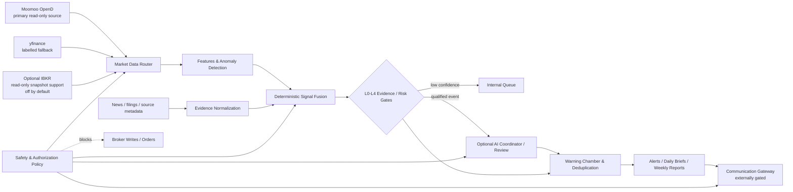

# Market Watchdog

[](https://github.com/jasperjlou/market-watchdog/actions/workflows/tests.yml)

**Market Watchdog is a read-only market-intelligence, evidence-fusion, and alerting system for U.S. equities.** It combines market data, regulatory/news evidence, deterministic risk rules, optional bounded AI review, and stateful deduplication to produce explainable alerts and recurring reports without exposing an order-placement path.

> Research and engineering project only. It does not provide investment advice, promise returns, or place trades.

## Current system topology


```mermaid
flowchart LR
    M[Moomoo OpenD\nprimary read-only source] --> R[Market Data Router]
    Y[yfinance\nlabelled fallback] --> R
    I[Optional IBKR\nread-only snapshot support\noff by default] --> R
    N[News / filings / source metadata] --> E[Evidence Normalization]

    R --> F[Features & Anomaly Detection]
    F --> X[Deterministic Signal Fusion]
    E --> X

    X --> G{L0-L4 Evidence / Risk Gates}
    G -->|low confidence| Q[Internal Queue]
    G -->|qualified event| A[Optional AI Coordinator / Review]
    A --> W[Warning Chamber & Deduplication]
    G --> W

    W --> O[Alerts / Daily Briefs / Weekly Reports]
    O --> C[Communication Gateway\nexternally gated]

    S[Safety & Authorization Policy] --> R
    S --> X
    S --> A
    S --> C
    S -. blocks .-> B[Broker Writes / Orders]
```

The deterministic pipeline owns symbol resolution, feature calculation, evidence requirements, deduplication, and safety checks. AI workers can review qualified events, but their output cannot bypass the same gates, call broker-write APIs, or silently promote weak evidence.

## What the repository implements

### Market-data routing

The checked-in configuration currently uses:

1. **Moomoo OpenD** as the primary enabled read-only source for supported U.S. stocks and ETFs;
2. **yfinance** as a labelled fallback source;
3. an **IBKR read-only provider path** that exists in the router and portfolio snapshot tooling but is **disabled by default** in `config/market_data.yaml`.

Every quote is expected to retain its source and collection time so the system can distinguish fresh, delayed, and fallback data instead of mixing them without attribution.

### Signal and evidence fusion

The system combines price/volume features with independent evidence rather than treating a price move as its own explanation. Current components cover:

- returns, moving averages, RSI, ATR, volume anomalies, and breakouts;
- theme breadth and cross-symbol context;
- news, filings, and source-quality metadata;
- multilingual issuer/symbol aliases;
- configurable event templates, scoring, scan policies, and risk controls;
- L0-L4 evidence and alert grading.

Price-only events remain bounded until corroborating evidence supports a higher-confidence interpretation.

### Stateful alerting

Repeated events are tracked rather than emitted as isolated messages. Re-notification is reserved for material changes such as:

- severity changes;
- direction flips;
- materially new evidence;
- relevant portfolio/threshold changes;
- scheduled close or periodic review.

This keeps the system from repeatedly alerting on the same underlying event simply because multiple sources repeat it.

### AI orchestration

The repository now includes a larger orchestration layer around the deterministic core, including:

- `ai_coordinator.py` and agent routing;
- bounded Codex/query workers and fusion gates;
- communication policy and gateway controls;
- runtime-isolation rules;
- read-only portfolio snapshots;
- recurring daily-market briefs;
- integration metadata and authorization checks.

These components are deliberately isolated. An unavailable AI provider, messaging integration, or optional sidecar should not stop the deterministic market-data and evidence pipeline.

## Safety model

Safety is part of the architecture rather than a final UI warning.

- `actual_broker_writes` is `false` in shipped policy.
- Moomoo trade-context use is restricted to read-only account/position queries.
- The optional IBKR path is read-only and disabled by default in the current market-data configuration.
- Order, cancel, modify, and transmit paths are not part of the public application flow.
- External communication is independently gated and disabled in the public snapshot unless explicitly configured.
- Credentials, account identifiers, private portfolio snapshots, runtime logs, local caches, and deployment-specific secrets stay outside the repository.
- AI output is treated as advisory evidence and remains subject to deterministic authorization and alert gates.

## Repository layout

| Path | Purpose |
| --- | --- |
| `agent/scripts/` | Market-data routing, snapshots, features, evidence fusion, AI coordination, alerting, reports, integration and authorization logic |
| `agent/config/` | AI orchestration, evidence tiers, communication rules, source catalogues, runtime isolation and worker policy |
| `agent/policies/` | Explicit capability / permission boundaries |
| `agent/schemas/` | Structured contracts for AI evidence and outbound messages |
| `config/` | Watch universe, data-provider policy, source catalogue, event templates, scoring, thresholds and risk controls |
| `agent/tests/` | Regression coverage for signals, safety gates, deduplication, integrations and message boundaries |
| `docs/` | Runtime isolation, data curation, architecture and operational notes |

## Quick start

Python 3.11 or later is recommended.

```bash
python -m venv .venv
python -m pip install -r requirements-vps.txt
python -m pip install pytest
python -m pytest -q agent/tests
```

Create a labelled K-line snapshot without requiring Moomoo:

```bash
python agent/scripts/kline_snapshot.py \
  --symbols NVDA,AMD,MU,GLD,RKLB \
  --period 6mo \
  --interval 1d \
  --no-live-snapshot \
  --output .local/kline_snapshot.json \
  --replace-output
```

Moomoo support is optional at installation time and uses the official OpenD client on loopback:

```bash
python -m pip install -r requirements-market-data.txt
```

The current checked-in provider policy prioritizes Moomoo and uses yfinance as fallback. If an alternative provider path is enabled locally, it remains subject to the same source labelling and read-only safety requirements.

## Design principles

1. **Evidence before explanation.** A market move is not automatically a verified causal story.
2. **Deterministic safety before model judgment.** Models can review; they do not define permissions.
3. **State before spam.** Events have identities, severity, evidence state, and cooldown history.
4. **Source attribution everywhere.** Quotes and evidence preserve where they came from and when they were collected.
5. **Graceful degradation.** Optional integrations can fail without collapsing the core scanner.
6. **Read-only by construction.** The project is designed for monitoring and analysis, not execution.

## Scope

This public repository is a sanitized engineering snapshot. It demonstrates the architecture, rules, schemas, tests, and read-only integration patterns. It intentionally excludes personal financial data, live credentials, production endpoints, and private communication state.
