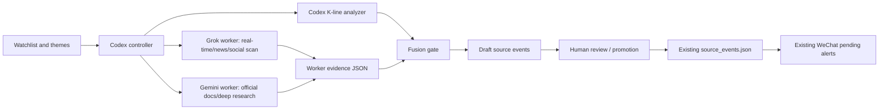

# News And K-Line Trading Intelligence Design

This design extends market-watchdog into a news and chart intelligence system
without turning it into an automatic trading bot.

## Objective

The system should detect potentially market-moving information, connect it to
selected watchlist stocks/ETFs, check whether price action confirms the event,
and push only high-quality review items into the existing alert workflow.

The trading loop remains human-in-the-loop:

1. Workers collect evidence.
2. Codex normalizes, scores, and analyzes.
3. Existing risk gates and pending-alert inbox handle review.
4. The user decides what to do in IBKR manually.

## Architecture



## Division Of Labor

Grok:

- Fast current-event sweep.
- Broad media and social signal discovery.
- Conflicting-source discovery.
- Rumor labeling and low-trust source warnings.
- Output only structured evidence.

Gemini:

- Official filing/document/source research.
- Longer context synthesis.
- Company, regulator, exchange, central-bank, and macro source checks.
- Source triangulation and background explanation.
- Output only structured evidence.

Codex:

- Task routing.
- Evidence validation and deduplication.
- K-line, trend, volatility, and volume analysis.
- Scoring and level gates.
- Promotion into market-watchdog state only after gates pass.
- Human-readable review brief.

## Data Flow

### 1. Task Creation

Codex reads:

- `/app/config/watchlist.yaml`
- `/app/config/sources.yaml`
- `/app/config/scoring.yaml`
- `/app/agent/config/news_trading_pipeline.yaml`

It creates worker prompts that include selected symbols, themes, time windows,
source tiers, and the required JSON schema.

### 2. Worker Evidence

Workers write raw artifacts under:

```text
/app/agent/runs/<timestamp>_<worker>_<mode>/
```

Each run stores:

- `request.json`
- `prompt.txt`
- `raw_output.txt`
- `result.json`

Worker outputs are not trusted until Codex validates them.

### 3. Chart Context

Codex computes K-line features:

- close vs 20/60-day averages
- 1/5/20-day returns
- RSI 14
- ATR percent
- 20-day breakout/breakdown
- volume z-score
- trend classification

The first implementation uses yfinance as a convenient S2 market-data source.
IBKR read-only can later be added as a confirmation source.

### 4. Fusion And Scoring

Codex builds draft events by combining:

- source tier
- event freshness
- symbol/entity relevance
- topic relevance
- corroboration count
- K-line resonance

Promotion rules:

- S3-only evidence is capped at L1.
- L2 needs S0/S1 evidence or obvious price resonance.
- L3 needs high score plus official confirmation and strong price resonance, or
  dual official confirmation.
- Nothing is promoted to execution. Promotion only means "human review alert".

### 5. Existing Alert Pipeline

After a draft event is manually approved or explicitly committed, it can enter:

```text
/app/state/source_events.json
```

Then the existing scripts can build pending alerts and send gated WeChat
notifications.

## Source Tiering

- S0: primary official sources, regulators, exchanges, issuer filings,
  government agencies, central banks.
- S1: official or quasi-official market and macro data.
- S2: high-trust news/research/data aggregators.
- S3: broad media, social, alternative data, weak signals.

S3 sources are useful for early detection, but they are not enough for a trade
alert above L1.

## News Trading Guardrails

The system must avoid three common failure modes:

1. Speed without verification.
2. Price movement without causal evidence.
3. Evidence without price confirmation.

The intended signal is "event plus price resonance plus relevance", not simply
"headline exists".

## Sidecar Recommendation

Gemini and Grok CLIs should run in a sidecar container or sandboxed workspace.
They should not run inside the production IBKR/WeChat/Gmail container with
access to `/app/secrets`.

Recommended sidecar mount policy:

- read-only: `/app/config`, `/app/docs`, selected non-secret scripts
- read-write: `/app/agent/runs`, `/app/agent/state`
- no access: `/app/secrets`, `/root`, Docker socket, SSH keys, IBKR profiles

## Operating Modes

Dry run:

- Writes prompts and local analysis only.
- No worker CLI execution.
- No source-event commit.

Worker execute:

- Runs Gemini/Grok CLI only when installed and explicitly requested.
- Stores raw outputs.
- Does not promote events.

Fusion dry run:

- Builds draft source events under `/app/agent/state`.
- No notification and no source-event commit.

Commit mode:

- Requires explicit environment gate.
- Appends validated draft events to `/app/state/source_events.json`.
- Still does not place orders.

## Minimum Viable Loop

1. Run Grok/Gemini news scan for selected symbols.
2. Run K-line snapshot.
3. Run Codex fusion gate.
4. Review draft events.
5. Promote accepted events into existing alert inbox.

## Later Improvements

- Add IBKR historical data confirmation for selected symbols.
- Add scheduled event windows around earnings, CPI, FOMC, jobs, and major
  company events.
- Add source-specific adapters for SEC EDGAR, exchange halts, company IR RSS,
  and official macro feeds.
- Add replay/evaluation with historical news and price moves.
- Add false-positive review labels so scoring can improve over time.
